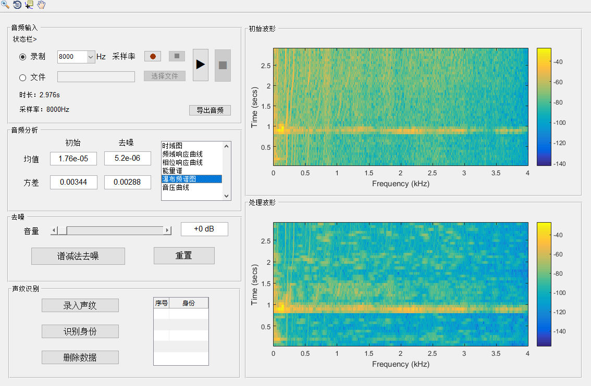

# Matlab数字音频处理系统
-------
## 软件
- matlab2016

## 开发博客
- [功能概览与GUI](http://cunia.cc/2017/10/21/%E5%9F%BA%E4%BA%8Ematlab-GUI%E6%95%B0%E5%AD%97%E9%9F%B3%E9%A2%91%E5%A4%84%E7%90%86%E7%B3%BB%E7%BB%9F%EF%BC%88%E4%B8%80%EF%BC%89/)
- [功能模块的实现](http://cunia.cc/2017/10/22/%E5%9F%BA%E4%BA%8Ematlab-GUI%E6%95%B0%E5%AD%97%E9%9F%B3%E9%A2%91%E5%A4%84%E7%90%86%E7%B3%BB%E7%BB%9F%EF%BC%88%E4%BA%8C%EF%BC%89/)

## 功能
- 音频录入与导出
- 音频波形
- 音频去噪
- 声纹识别
## 界面
